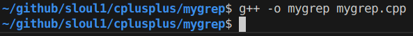
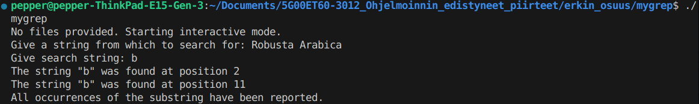
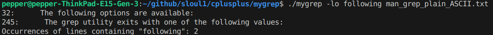

> [!CAUTION]
> WIP. Work in progress. Program might not fully comply to described increments. This warning will be removed after this project is completed.  

# Linux grep like tool 'mygrep' in C++

## Usage

Compile: `g++ -o mygrep mygrep.cpp`  
  
Run in interactive mode: `./mygrep`  
  
Run in file mode: `./mygrep following man_grep_plain_ASCII.txt`  
  
Run in file mode with switches for line numbering `-l` and total occurrences `-o`: `./mygrep -lo following man_grep_plain_ASCII.txt`

## Five planned increments.

> [!CAUTION]
> All increments must include all functionalities of previous increments

### 1/4 increment:

The program asks the user for a "large" string 
from which to search for a smaller string. The latter can be found anywhere in the large string. If the string to be searched for is found in the large string, its occurrence is reported starting from position 0. In all cases, a message is printed that the string has been found.

### 2/4 increment:

The increment must also include the functionality of the previous increment, i.e. if the program is still started with just the program file (binary) name `./mygrep`.

If the program is started from the command line as described below, its usage will begin to resemble basic grep usage with command line arguments.

```bash
./mygrep following man_grep_plain_ASCII.txt 
     The following options are available:
     The grep utility exits with one of the following values:
```

The program goes through the contents of the ASCII file given to it line by line and if the searched string `"following"` (2nd command line argument) is found somewhere within each line, the line in question is printed; otherwise, it is not. The operation is exactly the same as the operation of grep in it's simplest use.

### 3/4 increment: simple statistical analysis

mygrep should be able to run so that:

- If desired, it prints the line numbers in a large file in front of the lines found

- If desired, at the end of the run, mygrep prints information about how many lines in the file contained the string you searched for.

Both of these features are controlled using command line arguments: if line numbering is desired, it is specified using a command line argument; the same applies to counting the number of lines.

Example run:
```bash
./mygrep -olo following man_grep_plain_ASCII.txt 
32:     The following options are available:
245:     The grep utility exits with one of the following values:

Occurrences of lines containing "following": 2
``` 

As you can see from the example run, these additional optional options are provided in the form `-olo`. You can interpret this to mean that `-o` tells that the desired options that affect the execution of the program are listed after it, and `l = line numbering` and `o = occurrences`. Now there are four command line arguments instead of three.

If the option specification is `-ol`, only the line numbers are printed, and if it is `-oo`, only the number of lines that have occurred is printed. The user can then specify these options in a selective manner.
